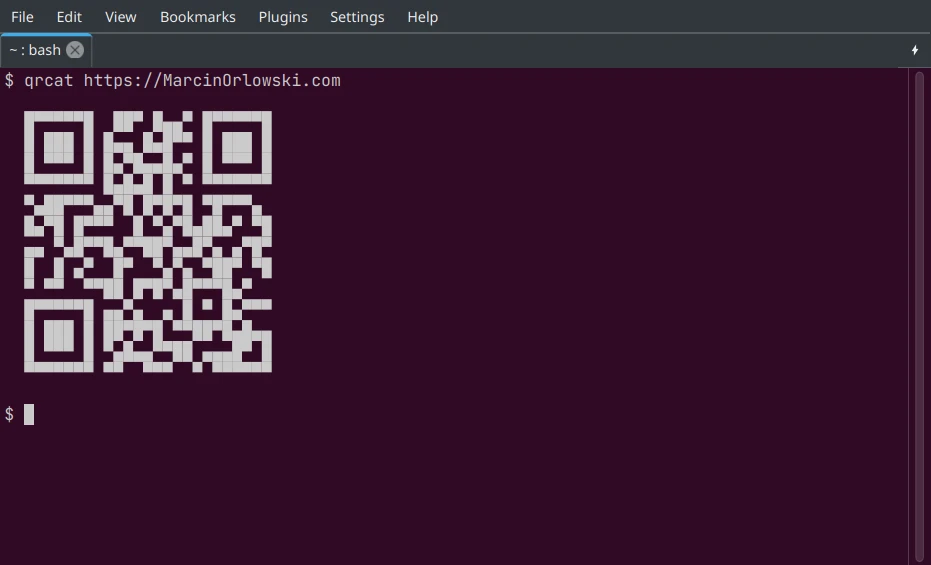

# qrcat

`qrcat` (pronounced `Purr Cat`) is a command line utility that prints QR codes directly to your
terminal using nothing but block characters.



## Features

- Works in any unicode-capable terminal.
- Pluggable renderer architecture - half-block today, quadrant etc.
- Can also act as library for your Python project from the same package.

## Installation

Use [pipx](https://pypi.org/project/pipx/) package manager to install `qrcat` as standalone
application.

```bash
pipx install qrcat
```

Once installed `qrcat` executable should be instantly available in your terminal.

## Use as library in your own projects

Aside from being a CLI tool, you can use `qrcat` as library in your Python project and generate QR
codes from and for your Python project. See [dev docs](docs/README.md) for more information.

## License

* Written and copyrighted &copy;2026 by Marcin Orlowski <mail (#) marcinorlowski (.) com>
* `qrcat` is open-source software licensed under
  the [MIT license](http://opensource.org/licenses/MIT)
